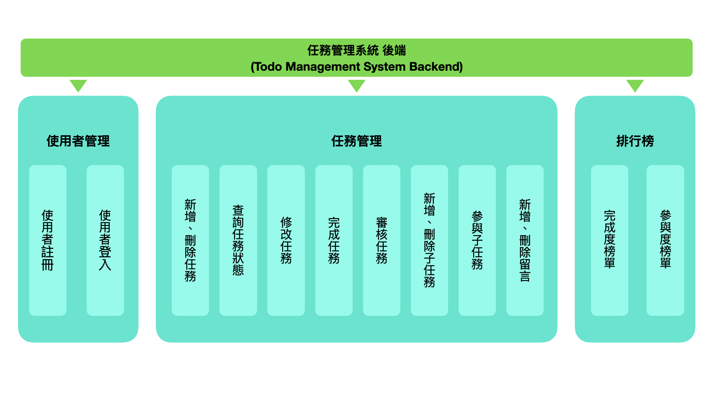
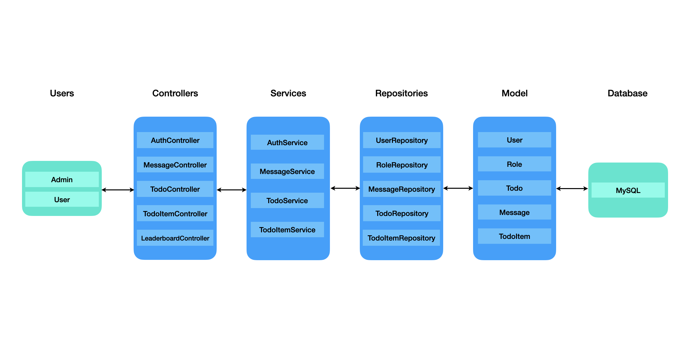
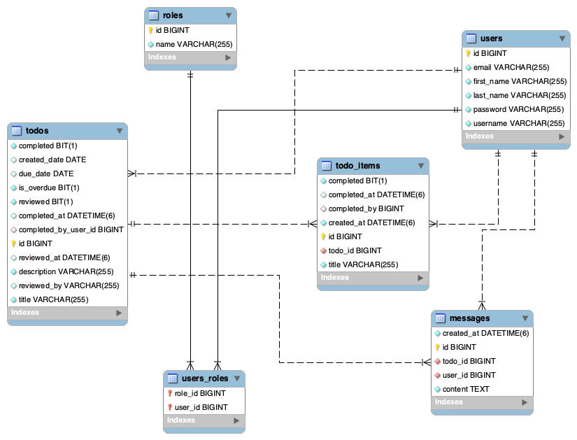

# 任務管理系統（Todo Management System）

# 系統介紹
- 本專案為 **任務管理系統（Task Management System）**，由練習基礎語法的 Todo Management System 延伸而來，後續嘗試將工作中接觸到的技術與研究概念融入系統設計，進一步擴充功能與介面。  
- 系統採用 **前後端分離架構** 開發：前端以 **React.js** 建立使用者介面，後端則以 **Spring Boot + MySQL** 開發 API 服務。  
- 功能涵蓋任務的新增、編輯、參與、刪除與完成，以及任務資訊與進度的即時呈現。 
- 本檔案為 **後端原始碼**，前端原始碼請見：[Task Management System |前端原始碼](https://github.com/felixven/todo-frontend.git)

# 功能介紹
- 使用者管理：註冊 / 登入 / JWT Token 驗證，支援角色權限分流。
- 任務管理：任務建立、更新、刪除、查詢，子任務建立、更新、刪除、查詢，任務參與、完成、審核
- 排行榜 API：提供協作參與次數與任務完成數資料查詢。

# 系統架構
### 系統架構圖
下圖為系統功能架構圖，將前述三大模組與其細部功能以總覽方式呈現：

<br/>

### 程式分層設計
後端採用 **分層架構設計**，依職責將程式劃分Controller、Service、Repository 與 Model，各層責任如下：
- **Controller 層**：接收API請求，回傳 JSON 回應（例如：`AuthController`, `TodoController`）  
- **Service 層**：處理業務邏輯（例如：`AuthService`, `TodoService`）  
- **Repository 層**：透過 Spring Data JPA 與 MySQL 互動（例如：`UserRepository`, `TodoRepository`）  
- **Model 層**：資料表對應的實體類別（例如：`User`, `Role`, `Todo`）


<br/>

### 資料庫設計
本系統主要資料表及其關聯設計如下所示：
- `users`：使用者  
- `roles`：角色  
- `users_roles`：使用者與角色關聯  
- `todos`：任務  
- `todo_items`：子任務  
- `messages`：留言  



### 使用技術
- Java Spring Boot
- MySQL

## 本機安裝與使用
1. 建立資料庫
   ```bash
   CREATE DATABASE todo_db;
   ```
2. 取得原始碼
   ```bash
   git clone https://github.com/felixven/todo-backend.git
   cd todo-backend
   ```
   
3. 設定資料庫與環境  
   編輯 `src/main/resources/application.properties`，填入以下內容：

   ```properties
   spring.datasource.url=jdbc:mysql://localhost:3306/todo_db
   spring.datasource.username=<yourusername>
   spring.datasource.password=<yourpassword>
   # 請將 <yourusername> 與 <yourpassword> 替換為您本機 MySQL 的username和password。

   spring.jpa.hibernate.ddl-auto=update

   # JWT 金鑰（自行更換）
   jwt.secret=your-secret-key
   ```
   
4. 啟動後端服務
   ```bash
   ./mvnw spring-boot:run
   #預設服務位置：http://localhost:8080
   ```
   
5. 預設帳號
   專案啟動後會自動建立預設帳號，可直接在Postman Login API Request Body 填入再進行測試，亦可透過Register API 建立新帳號：
    - Admin帳號
        - 帳號：admin
        - 密碼：admin1234
        - Request Body Json 範例：
        ```json
        {
         "usernameOrEmail":"admin",
         "password":"admin1234"
        } 
        ```
    - User帳號
        - 帳號：user
        - 密碼：user1234
        - Request Body Json 範例：
       ```json
        {
         "usernameOrEmail":"user",
         "password":"user1234"
        } 
        ``` 
6. 測試 API (Postman Collection)
  - 匯入本專案提供的 [Postman Collection](docs/Spring_Boot_Todo_API.json)
  - 匯入本專案提供的 [Postman Environment](docs/todo_env.json)
  - 開啟 Postman，選擇 `todo_env` 環境，點擊 **Run Collection**